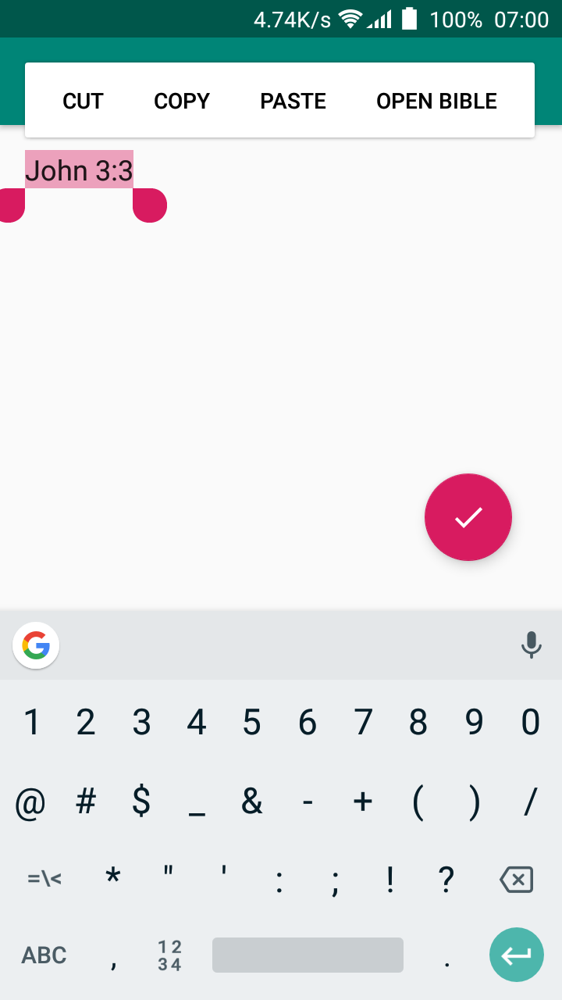
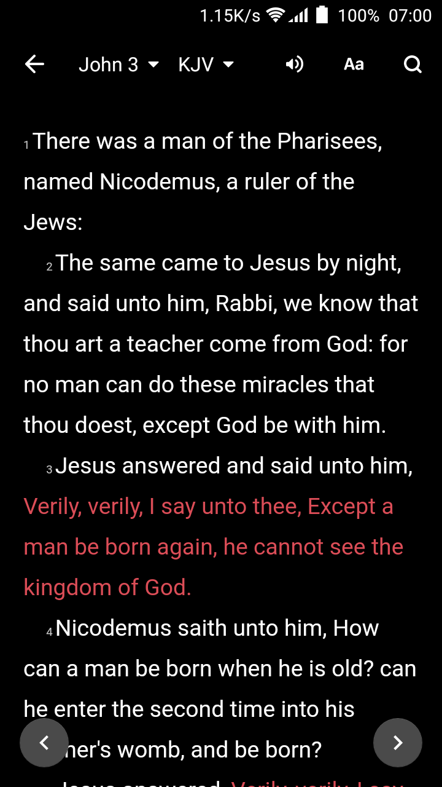

# Bible Note

## Overview
Note taking app which allows for directly selecting and opening bible verses in YouVersion Bible.

## Screenshot
  

## App features
* Uses ActionMode to add options to the native textview actions.
* Uses Google Sign In

## Getting Started

The app uses the Gradle build system. To build this project, use the
"gradlew build" command or use "Import Project" in Android Studio.

## Prerequisites

- Android SDK v28
- Android Build Tools v28.0.3
- Android Support Repository v28.0.0
- Gradle 3.2.1

## Author

Zizoh Anto

## License

This project is licensed under the Apache License 2.0 - See: http://www.apache.org/licenses/LICENSE-2.0.txt
